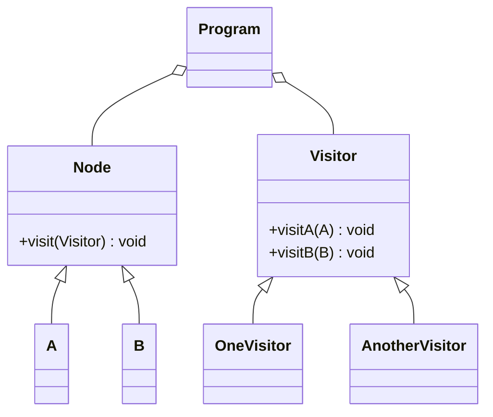

定义：
>
> 允许将一个或多个操作应用到一组对象上，
> 将操作与数据解耦开。
>

```mermaid
classDiagram
    class Visitor{
        +visitA(A) void
        +visitB(B) void
    }
    
    class OneVisitor {
    }
    Visitor <|-- OneVisitor
    class AnotherVisitor{
    
    }
    Visitor <|-- AnotherVisitor
    
    class Node{
        +visit(Visitor) void
    }
    class A{
    }
    
    class B{
    }
    
    Node <|-- A
    Node <|-- B
    
    class Program{
    }
    
    Program o-- Node
    Program o-- Visitor
    
```

一组对象，就是图图中的Node实例。
操作则指的是Visitor的实例。

优点：
操作独立于数据结构。

缺点：
Node的增加比较麻烦

