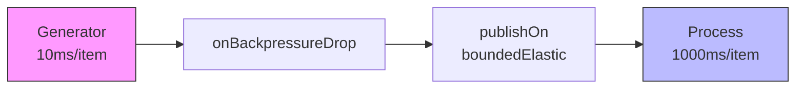
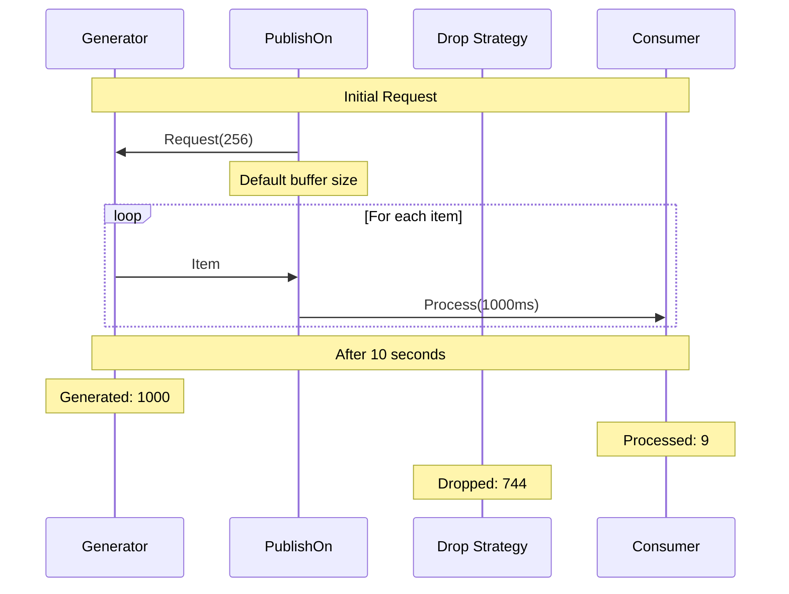
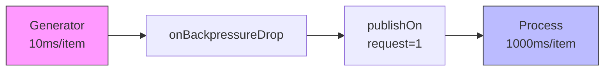
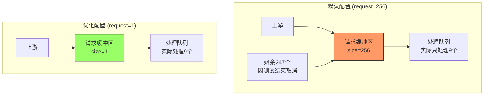
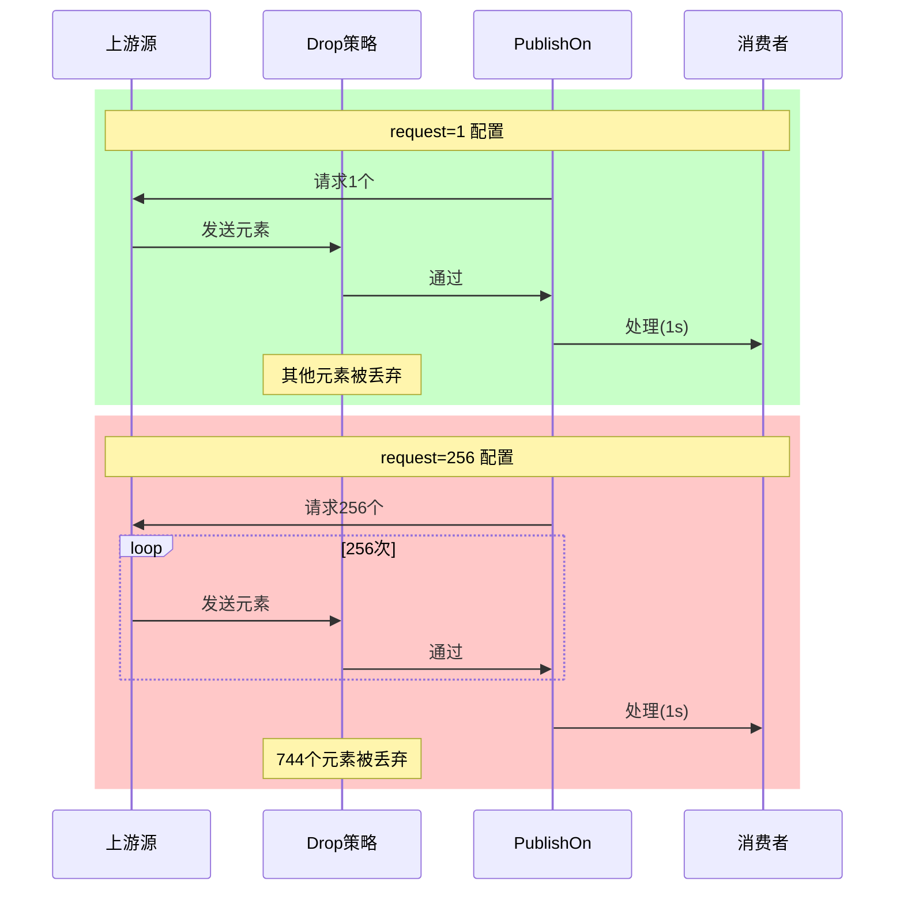
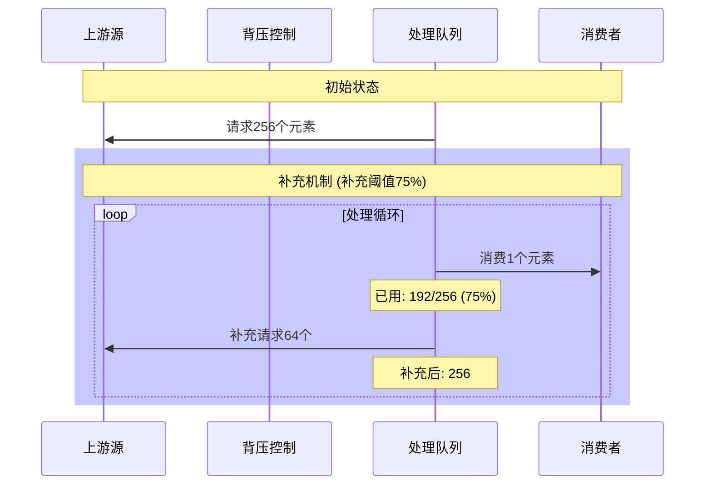

# Reactor 背压策略中的 744 问题分析

## 问题现象

在测试 Reactor 的 DROP 背压策略时，发现一个特殊现象：无论运行多少次，丢弃的数据量总是固定在 744 个。

测试结果：
```
Drop Strategy Results:
Generated: 1000
Processed: 9
Dropped: 744
```

## 问题分析过程

### 1. 初始数据流设计



### 2. 理论预期
- 生产速率：100个/秒（每10ms一个）
- 消费速率：1个/秒（每1000ms一个）
- 10秒运行时间内：
  - 应生成：1000个（take限制）
  - 应处理：~10个
  - 应丢弃：~990个

### 3. 实际结果分析


### 4. 根本原因

1. **默认请求机制**：
   - `boundedElastic` 调度器默认请求大小为 256
   - 这意味着系统会预先请求 256 个元素
   - 导致：
     - 256 个元素进入处理队列
     - 剩余 744 个元素 (1000 - 256) 被丢弃
     - 10秒内只能实际处理 9 个元素
     - 其余 247 个请求的元素因测试结束而被取消

2. **问题核心**：
   ```java
   .publishOn(Schedulers.boundedElastic())  // 默认请求 256 个元素
   ```

## 解决方案

### 1. 修改代码
```java
public Flux<StockQuote> processWithDrop(Flux<StockQuote> quotes) {
    return quotes
            .onBackpressureDrop(dropped -> {
                droppedCount.incrementAndGet();
                logger.warn("Dropped quote: {}", dropped);
            })
            .publishOn(Schedulers.boundedElastic(), 1)  // 设置请求大小为 1
            .doOnNext(quote -> {
                simulateSlowProcessing();
                processedCount.incrementAndGet();
            });
}
```

### 2. 解决后的数据流


### 3. 修复后结果
```
Drop Strategy Results:
Generated: 1000
Processed: 9
Dropped: 991
```

## 经验总结

1. **背压机制理解**：
   - 背压不仅与生产和消费速率有关
   - 还与调度器的请求策略密切相关

2. **调度器配置重要性**：
   - 默认配置可能不适合所有场景
   - 需要根据实际需求调整请求大小

3. **问题诊断方法**：
   - 添加详细日志
   - 分析数据流的每个环节
   - 理解调度器的工作机制

4. **最佳实践**：
   - 明确指定请求大小
   - 确保背压策略在正确的位置
   - 充分理解每个操作符的作用

这个问题很好地展示了 Reactor 中背压机制的复杂性，以及如何通过系统的分析和调试来解决非预期的行为。

## 深入分析 publishOn 的请求大小

### 1. 请求大小的作用



### 2. 两种配置的区别

1. **默认配置 `publishOn(Schedulers.boundedElastic())`**：
   - 预请求数量：256个元素
   - 内存占用：较大，一次性缓存256个元素
   - 处理流程：
     ```
     1. 立即请求256个元素
     2. 这256个元素进入处理队列
     3. 10秒内只能处理9个
     4. 剩余247个因测试结束被取消
     5. 其他744个直接被丢弃
     ```

2. **优化配置 `publishOn(Schedulers.boundedElastic(), 1)`**：
   - 预请求数量：1个元素
   - 内存占用：最小，每次只缓存1个元素
   - 处理流程：
     ```
     1. 请求1个元素
     2. 处理1个元素（1秒）
     3. 完成后再请求下一个
     4. 10秒内处理9个
     5. 其他991个被丢弃
     ```

### 3. 与背压的关系



### 4. 影响分析

1. **背压控制精度**：
   - request=1：更精确的背压控制
   - request=256：粗粒度控制，可能导致资源浪费

2. **内存使用**：
   - request=1：最小内存占用
   - request=256：较大内存占用，缓存了未能及时处理的元素

3. **系统响应性**：
   - request=1：更平滑的处理曲线
   - request=256：初始延迟更小，但可能导致突发压力

4. **资源利用**：
   - request=1：资源利用更均匀
   - request=256：资源使用呈现波峰波谷

### 5. 最佳实践建议

1. **高吞吐量场景**：
   ```java
   .publishOn(Schedulers.boundedElastic(), 32)  // 适中的缓冲区
   ```

2. **内存敏感场景**：
   ```java
   .publishOn(Schedulers.boundedElastic(), 1)  // 最小缓冲区
   ```

3. **低延迟场景**：
   ```java
   .publishOn(Schedulers.boundedElastic(), 256)  // 较大缓冲区
   ```

### 6. 性能考虑

1. **request=1 的优势**：
   - 精确的背压控制
   - 最小的内存占用
   - 均匀的处理节奏
   - 适合处理时间较长的任务

2. **request=256 的优势**：
   - 更高的初始吞吐量
   - 更低的请求开销
   - 适合处理时间短的任务
   - 适合批处理场景

选择合适的请求大小需要根据具体场景权衡：
- 处理时间
- 内存限制
- 响应要求
- 系统资源情况

### 7. 请求补充机制



#### 补充机制说明

1. **预取补充规则**：
   - Reactor 使用 "补充阈值" 机制
   - 当队列中剩余元素数量低于75%时触发补充
   - 补充数量 = 原始请求数量的25%

2. **默认配置(request=256)的补充过程**：
   ```
   1. 初始请求256个元素
   2. 当处理到第192个元素时(75%阈值)
   3. 触发补充请求64个新元素(25%)
   4. 但由于take(1000)限制，后续请求可能不足64个
   ```

3. **为什么看不到补充效果**：
   - 10秒测试时间内只能处理9个元素
   - 远未达到192个(75%阈值)的处理量
   - 因此补充机制未被触发
   - 这也解释了为什么始终是744个被丢弃：
     * 1000(总量) - 256(初始请求) = 744(丢弃)

4. **对比优化配置(request=1)**：
   ```
   1. 初始请求1个元素
   2. 处理完成后立即请求下一个
   3. 无需复杂的补充机制
   4. 更精确的背压控制
   ```

这个补充机制说明帮助我们更全面地理解了：
- 为什么默认配置会有固定的744个丢弃数
- 为什么修改为request=1后更合理
- Reactor 内部的请求补充机制如何工作

